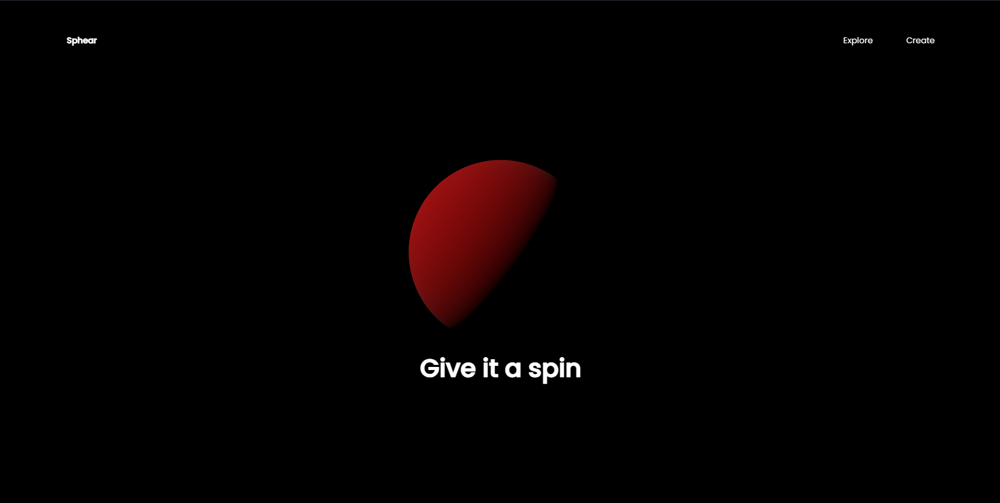

# Read me⚠ 
## Greetings 💐

# Simple Three js Example
Three.js is a JavaScript library that uses WebGL in an HTML5 canvas to render animations that alone are not possible to create in WebGL. This library is responsible for creating lighting effects, shadows, materials, textures, and 3D geometrical models, which are very hard to create in WebGL.

- This was Created by refernce of a youtube video ``` https://youtu.be/_OwJV2xL8M8?si=EwENtpmKpSql9tvy```

## Screen Shot
   ### Main Page
   

## Modificarion
- In youtube video , we need to modify some changes like Light intensity ,  do Your self and Enjoy😊 


## Contributing

If you'd like to contribute to this project, feel free to fork the repository and submit a pull request. You can also open issues for bug reports or feature requests.

## Thank You ☠
